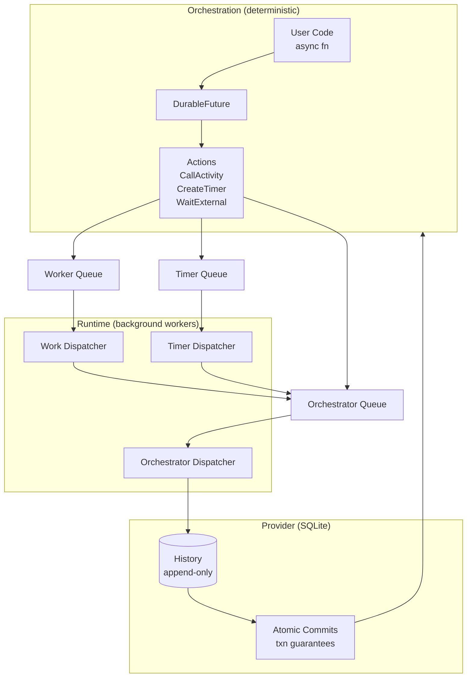
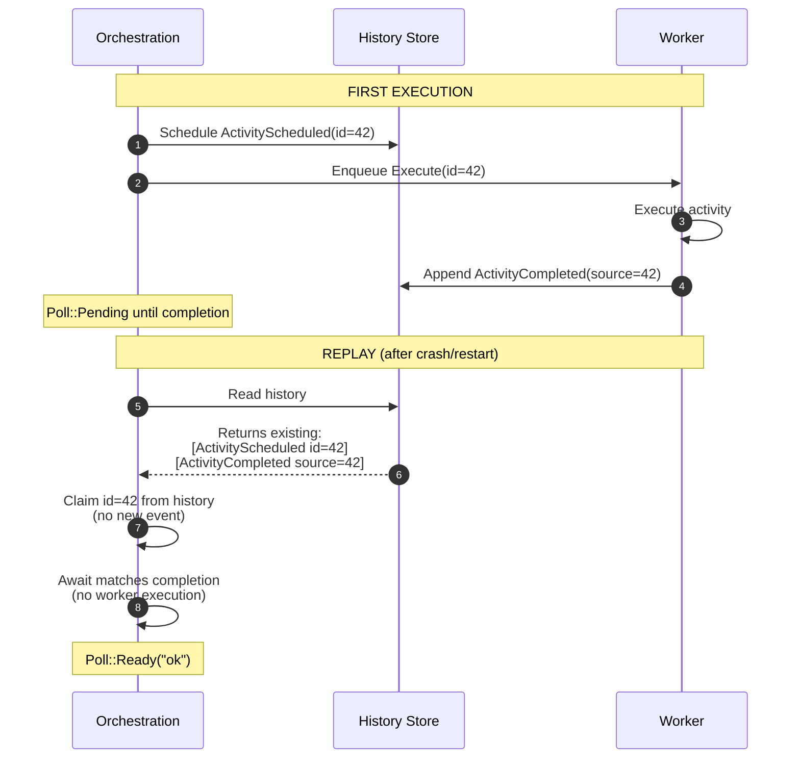
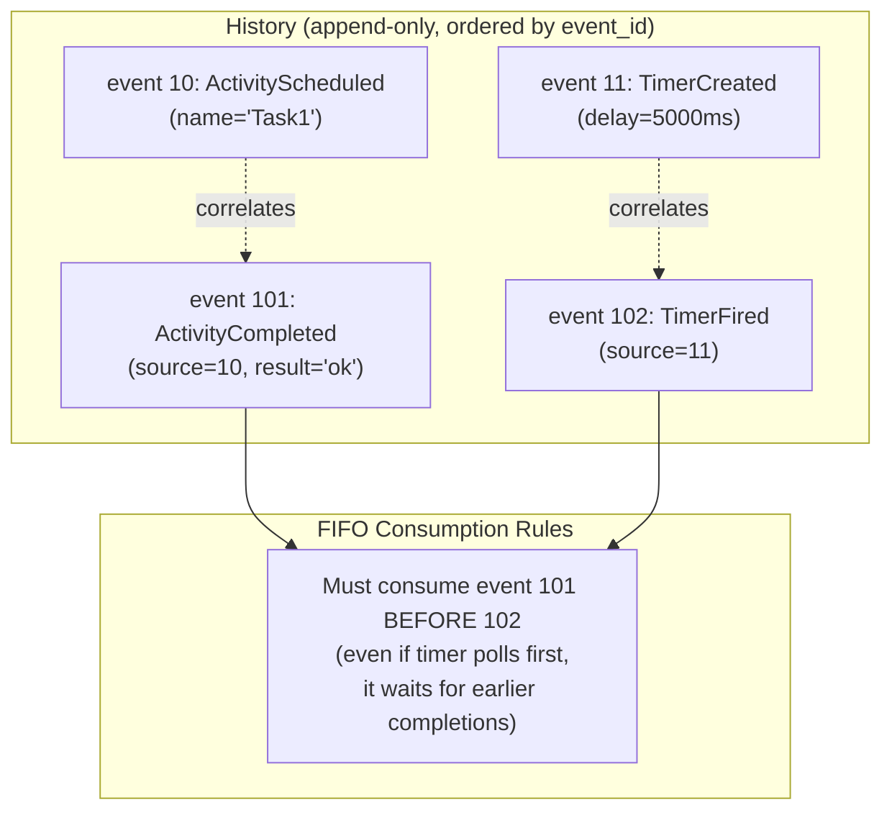
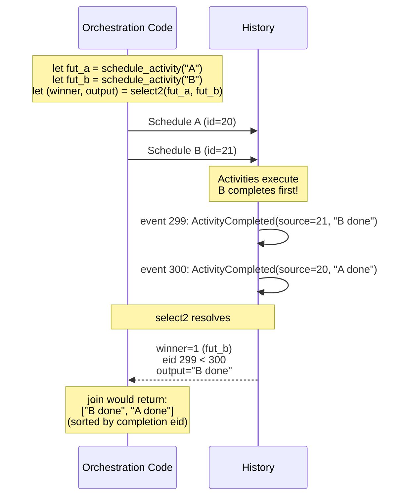
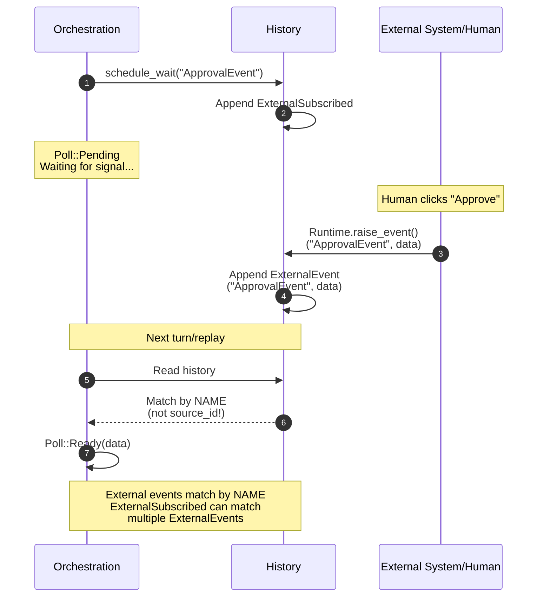
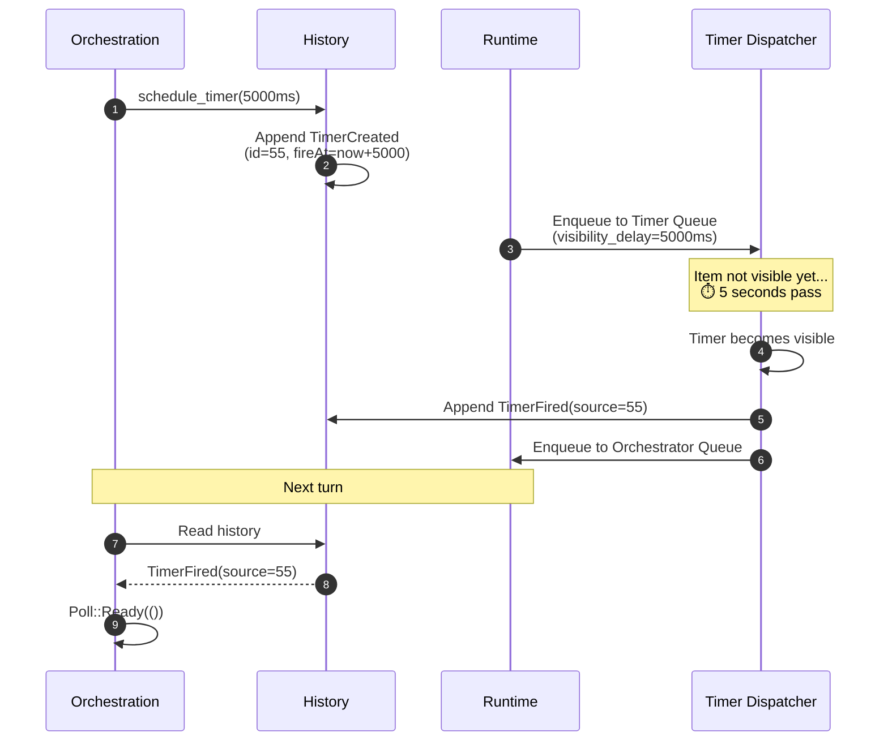
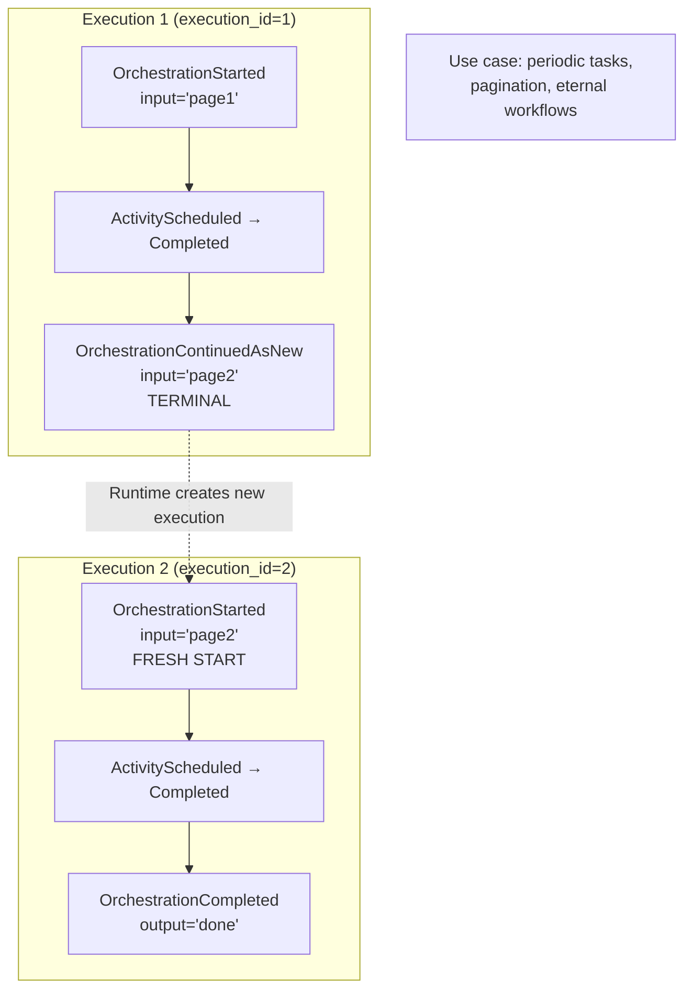
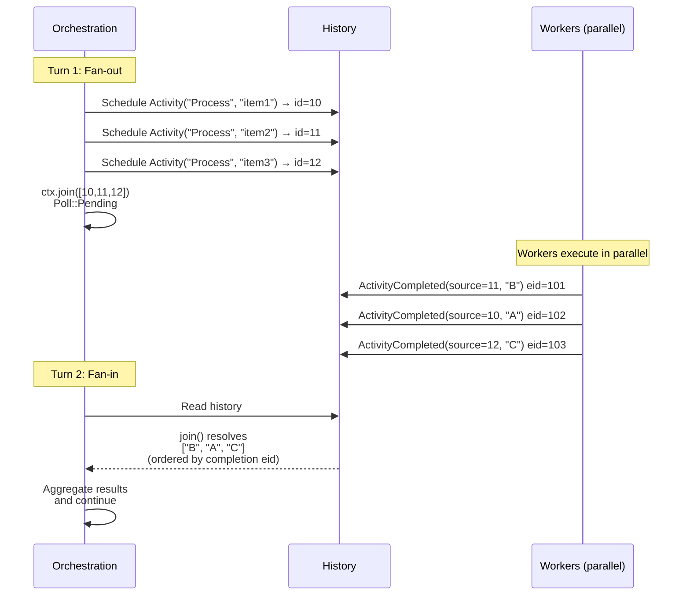

# Duroxide: Deterministic Task Orchestration in Rust

---

## Agenda

- Basic workflow concepts for code-based workflow engines
- Mechanics of replay
- How replay is implemented in Duroxide
- Sample orchestrations

---

## Basic Concepts: Code-Based Workflow Engines

- **Orchestrations**: async functions defining workflow logic; must be deterministic
- **Activities**: stateless side-effecting work (I/O, APIs, DB); retried by the runtime
- **Timers**: durable delays/timeouts; never block threads
- **External events**: signals from the outside world matched by name
- **History**: append-only log of decisions and outcomes enabling replay
- **Correlation IDs**: bind an await to its scheduled work and completion

---

## Determinism Rules (Do & Avoid)

- **Do**: pure control flow in orchestrations, schedule work via context methods
- **Do**: put all side effects in activities
- **Do**: use timers for all delays and deadlines
- **Avoid**: non-deterministic APIs in orchestration code (random, time, I/O)
- **Avoid**: sleeping/waiting in activities to simulate delays (use timers in orchestrations)

---

## Mechanics of Replay (General)

- **Idea**: Orchestrations rebuild state by re-executing code against prior history
- **Scheduling vs completion**:
  - First execution: schedule work and record events
  - Replays: do not reschedule; consume existing completions from history
- **Await mapping**: each await correlates to a prior completion by ID (or name for external events)
- **Outcome**: Same inputs + same history => same decisions every time

---

## Replay: Failure and Recovery

- **Crash during execution**: runtime restarts, replays history, resumes at next await
- **Idempotence**: activity side effects occur once; duplicative scheduling is avoided by replay
- **Races**: select/join must resolve deterministically from persisted completion order

---

## Duroxide: Data Model

- **Events** (append-only history):
  - `OrchestrationStarted`, `OrchestrationCompleted`/`Failed`
  - `ActivityScheduled` → `ActivityCompleted`/`Failed`
  - `TimerCreated` → `TimerFired`
  - `ExternalSubscribed` ↔ `ExternalEvent`
  - `SubOrchestrationScheduled` → `SubOrchestrationCompleted`/`Failed`
  - `SystemCall` (e.g., time, guid, trace)
- **Actions** (host decisions):
  - `CallActivity`, `CreateTimer`, `WaitExternal`
  - `StartSubOrchestration`, `StartOrchestrationDetached`
  - `ContinueAsNew`, `SystemCall`

---

## Duroxide: OrchestrationContext API

- Schedule work:
  - `schedule_activity`, `schedule_timer`, `schedule_wait`
  - `schedule_sub_orchestration`, `schedule_orchestration`
  - `continue_as_new`, `trace_*`
- Futures pattern:
  - All schedule calls return `DurableFuture`
  - Convert before awaiting: `.into_activity()`, `.into_timer()`, `.into_event()`, `.into_sub_orchestration()`
  - Compose with `select2`/`select` and `join`

---

## Duroxide: Replay Implementation (Core Loop)

- **Single-turn executor**:
  - `run_turn_with(history, turn_index, execution_id, orchestrator)` polls the orchestration once
  - Produces updated `history`, `actions`, and optional `output`
- **DurableFuture internals**:
  - On first poll, claim or create the matching scheduling event (`claimed_scheduling_events`)
  - Search history for the correlated completion; enforce FIFO consumption (`consumed_completions`)
  - Set nondeterminism hints if schedule order mismatches are detected
- **System calls**:
  - `utcnow_ms`, `guid`, `trace_*` use `SystemCall` events to persist computed values and replay safely

---

## Duroxide: Runtime and Queues

- **Dispatchers**:
  - Orchestrator dispatcher: pulls messages, runs atomic turns, appends history
  - Work dispatcher: executes activities and enqueues `ActivityCompleted`/`Failed`
  - Timer dispatcher: schedules `TimerFired` with delayed visibility (provider-backed)
- **Provider (SQLite)**:
  - Persists history and queues atomically with peek-lock semantics
  - Supports delayed visibility for timers for accurate wakeups

---

## Sample: Hello World

```rust
use duroxide::{OrchestrationContext, OrchestrationRegistry};
use duroxide::runtime::{self};
use duroxide::runtime::registry::ActivityRegistry;
use duroxide::providers::sqlite::SqliteProvider;
use std::sync::Arc;

# #[tokio::main]
# async fn main() {
let store = Arc::new(SqliteProvider::new("sqlite:./data.db").await.unwrap());
let activities = ActivityRegistry::builder()
    .register("Hello", |name: String| async move { Ok(format!("Hello, {name}!")) })
    .build();

let orch = |ctx: OrchestrationContext, name: String| async move {
    let res = ctx.schedule_activity("Hello", name).into_activity().await?;
    Ok::<_, String>(res)
};

let orchestrations = OrchestrationRegistry::builder().register("HelloWorld", orch).build();
let rt = runtime::Runtime::start_with_store(store.clone(), Arc::new(activities), orchestrations).await;
rt.clone().start_orchestration("inst-hello-1", "HelloWorld", "Rust").await.unwrap();
# rt.shutdown().await;
# }
```

---

## Sample: Fan-Out/Fan-In

```rust
use duroxide::{OrchestrationContext, DurableOutput};

async fn fanout(ctx: OrchestrationContext, items: Vec<String>) -> Result<String, String> {
    let futures = items.into_iter()
        .map(|it| ctx.schedule_activity("ProcessItem", it))
        .collect::<Vec<_>>();

    let results = ctx.join(futures).await; // deterministic history order
    let successes = results.into_iter().filter(|o| matches!(o, DurableOutput::Activity(Ok(_)))).count();
    Ok(format!("Processed {successes} items"))
}
```

---

## Sample: Human-in-the-Loop with Timeout

```rust
use duroxide::{OrchestrationContext, DurableOutput};

async fn approval(ctx: OrchestrationContext) -> String {
    let timeout = ctx.schedule_timer(30_000);
    let approve = ctx.schedule_wait("ApprovalEvent");
    let (_idx, out) = ctx.select2(timeout, approve).await;

    match out {
        DurableOutput::External(data) => data,     // approved by human
        DurableOutput::Timer => "timeout".into(),  // fallback path
        _ => "unexpected".into(),
    }
}
```

---

## Sample: Error Handling and Compensation

```rust
use duroxide::OrchestrationContext;

async fn compensating(ctx: OrchestrationContext) -> String {
    match ctx.schedule_activity("Fragile", "bad").into_activity().await {
        Ok(v) => v,
        Err(_e) => ctx.schedule_activity("Recover", "").into_activity().await.unwrap(),
    }
}
```

---

## Sample: ContinueAsNew (Periodic Processing)

```rust
use duroxide::OrchestrationContext;

async fn periodic(ctx: OrchestrationContext, next_cursor: String) -> Result<(), String> {
    let processed = ctx.schedule_activity("ProcessBatch", next_cursor).into_activity().await?;
    // Decide whether to continue with the next page/cursor
    ctx.continue_as_new(processed);
    Ok(())
}
```

---

## Good Practices

- **Keep orchestrations deterministic**: only schedule and coordinate
- **Keep activities idempotent**: tolerate retries
- **Use timers** for delays and backoffs
- **Use external events** for human/workflow callbacks
- **Leverage traces** via `ctx.trace_*` for replay-safe logging

---

## Q&A

- Explore `src/lib.rs`, `src/futures.rs`, and `src/runtime/` for deeper details
- See `examples/` and `tests/e2e_samples.rs` for runnable patterns

---

## Visual: Core components and message flow



---

## Visual: Replay mechanism (first run vs replay)



---

## Visual: Correlation and FIFO consumption



---

## Visual: select/join determinism



---

## Visual: Human-in-the-loop (external events)



---

## Visual: Timers and delayed visibility



---

## Visual: ContinueAsNew lifecycle



---

## Visual: Fan-out/Fan-in pattern




