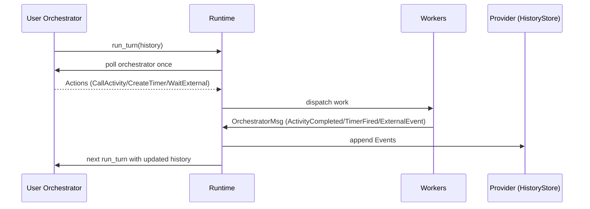
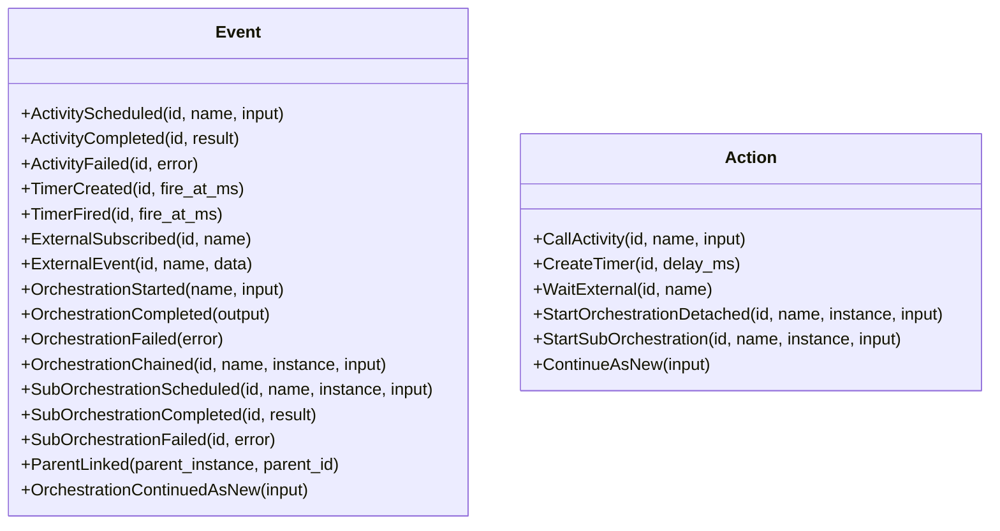
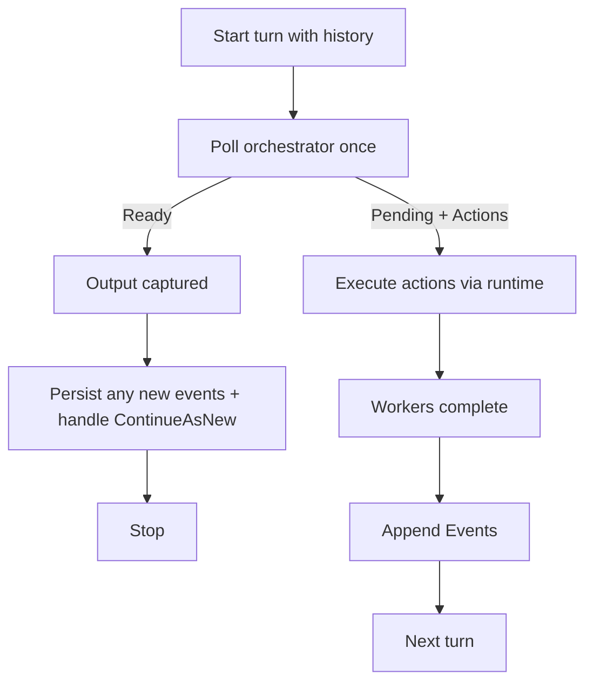

## Architecture and Execution Model

Deterministic orchestration hinges on separating decision-making (user code) from side-effects (host/runtime), with all effects captured in an append-only history.

### Components

- Orchestrator (user code): async function polled once per turn. It reads history and requests new work via `Action`s.
- Runtime (in-process): executes activities and timers, routes external events, and appends resulting `Event`s. It also runs a polling engine that consumes a provider-backed work queue (`WorkItem`) for completions and external signals, and auto-resumes incomplete instances at startup.
- Provider: persistence boundary that stores history per instance (`HistoryStore`).
- Workers: activity worker executes registered handlers; timer worker schedules real-time waits.

### High-level data flow

### Event and Action model

### Turn execution

### Races and correlation

- All schedule/subscribe ops allocate or adopt a correlation `id`.
- Completions are matched by `id` and buffered in history; composition via `select`/`join` is deterministic.
- We avoid relying on “next event in log” matching; multiple completions in one batch are safe.

### Multi-execution (ContinueAsNew)

- `ContinueAsNew` ends the current execution and starts a fresh one with new input.
- Providers persist all executions. Filesystem layout: `root/{instance}/{execution_id}.jsonl`.
- Runtime behavior:
  - Appends `OrchestrationContinuedAsNew` to the current execution.
  - Calls `reset_for_continue_as_new` on the provider to create the next execution with `OrchestrationStarted`.
  - Enqueues a `StartOrchestration` work item and notifies waiters for the initial start with an empty success.
  - External events are routed to the latest execution.

