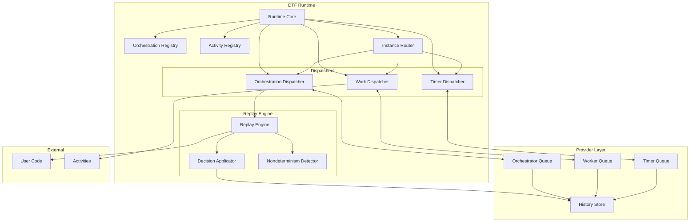
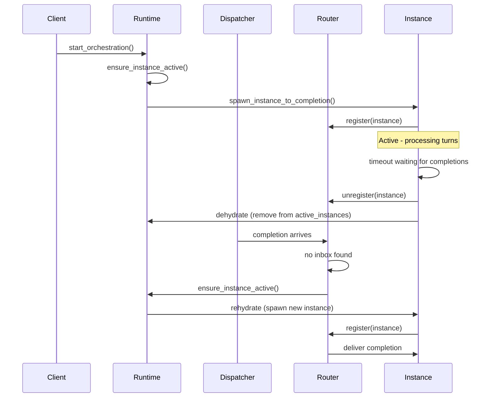

# DTF Runtime Architecture & Replay Design

## Overview

The DTF (Durable Task Framework) runtime is an event-sourced orchestration engine that provides deterministic execution of workflows through replay-based state reconstruction. This document details the architecture, component interactions, and replay mechanics.

## How Durable Execution Works

### The Fundamental Challenge
Traditional workflow engines face a critical problem: **how do you maintain the state of long-running workflows that may span hours, days, or even months, while surviving process crashes, machine failures, and code deployments?** Most approaches rely on persisting intermediate state, but this creates complexity around state serialization, versioning, and consistency.

DTF solves this through a radically different approach: **stateless replay from an immutable event log**.

### Event Sourcing Foundation
Instead of persisting workflow state, DTF records every significant action as an immutable **Event** in an append-only history:

- **`ActivityScheduled`** - "Schedule activity X with input Y"  
- **`ActivityCompleted`** - "Activity X completed with result Z"
- **`TimerCreated`** - "Create timer that fires at timestamp T"
- **`TimerFired`** - "Timer fired at timestamp T"
- **`OrchestrationStarted`** - "Workflow began with input I"
- **`OrchestrationCompleted`** - "Workflow finished with output O"

This event log becomes the **single source of truth** for all workflow state. No intermediate state is ever persisted - everything can be reconstructed by replaying the events.

### Deterministic Replay Mechanics
When a workflow needs to resume (after a crash, restart, or new completion), DTF performs **deterministic replay**:

1. **Load Event History**: Read the complete event log for the workflow instance
2. **Execute Orchestration Function**: Run the user's workflow code from the beginning
3. **Replay Completions**: When the code calls `await activity_result`, return the result from history instead of executing the activity again
4. **Capture New Decisions**: Record any new activities/timers the code wants to schedule
5. **Apply Side Effects**: Execute only the new decisions that weren't in the history

This replay is **deterministic** because:
- The orchestration function always sees the same inputs and completion results
- External calls (activities, timers) are memoized from history
- Only a single thread executes the orchestration logic
- The runtime controls all sources of non-determinism (time, randomness, I/O)

### Turn-Based Execution Model
Workflows execute in discrete **turns**, each triggered by external events:

```
Turn 1: Start workflow
  ├─ Schedule Activity A
  ├─ Schedule Activity B  
  └─ Wait for completions

Turn 2: Activity A completes
  ├─ Process A's result
  ├─ Schedule Activity C
  └─ Wait for more completions

Turn 3: Activity B completes
  ├─ Process B's result
  ├─ All work done
  └─ Return final result
```

Each turn is **atomic** - either all events from a turn are persisted, or none are. This ensures the workflow can always resume from a consistent state.

### Durable Execution Guarantees
This architecture provides several durable execution guarantees through its replay-based design:

**Crash Resilience**: Workflows survive process crashes and machine failures. When the runtime restarts, it loads the event history and replays the orchestration function to reconstruct the exact execution state. The workflow continues from the point where it was interrupted.

**Efficient Recovery**: Recovery requires only replaying the event history, without complex state restoration procedures. Recovery time depends on the number of events in the history rather than the elapsed time of the workflow execution.

**Code Evolution Support**: New versions of workflow code can process existing instances safely. Version pinning ensures that each execution uses a consistent code version, while nondeterminism detection prevents incompatible code changes from corrupting existing workflows.

**Horizontal Scaling**: Multiple runtime instances can process the same workflows concurrently. Since all state resides in the durable event store, runtime instances remain stateless and can be added or removed without affecting workflow execution.

**Exactly-Once Execution**: Each workflow step executes exactly once, even when failures and retries occur. The replay engine ensures that completed activities do not re-execute during replay, while failed activities can be retried safely.

**Long-Running Capability**: Workflows can execute for extended periods without degradation. The event-sourced design allows workflows to survive infrastructure changes, deployments, and maintenance operations over months or years of execution.

### Example: E-Commerce Order Processing
Consider an order processing workflow:

```rust
async fn process_order(ctx: OrchestrationContext, order: Order) -> Result<String, String> {
    // 1. Validate payment (may take seconds)
    let payment = ctx.schedule_activity("ValidatePayment", order.payment_info).into_activity().await?;
    
    // 2. Reserve inventory (may take minutes if checking multiple warehouses)
    let inventory = ctx.schedule_activity("ReserveInventory", order.items).into_activity().await?;
    
    // 3. Wait for manual fraud review (may take hours)
    let fraud_check = ctx.schedule_activity("FraudReview", order.clone()).into_activity().await?;
    
    // 4. Ship the order (may take days)
    let shipment = ctx.schedule_activity("ShipOrder", order.clone()).into_activity().await?;
    
    // 5. Wait 30 days for return window
    ctx.schedule_timer(Duration::from_days(30)).into_timer().await;
    
    // 6. Finalize the order
    ctx.schedule_activity("FinalizeOrder", order.id).into_activity().await?;
    
    Ok("Order completed successfully".to_string())
}
```

**Without DTF**: This workflow would require complex state management, database transactions, retry logic, and careful handling of partial failures. A crash during step 4 might leave the system in an inconsistent state.

**With DTF**: The workflow runs as simple, linear code. If the process crashes at any point:
1. The event history contains all completed steps
2. On restart, DTF replays the events to reconstruct the exact state
3. The workflow resumes from where it left off
4. No state corruption, no lost work, no manual intervention needed

### Example: Cloud Infrastructure Provisioning
Consider a cloud provisioning workflow that creates three resources in parallel:

```rust
async fn provision_cloud_environment(ctx: OrchestrationContext, request: ProvisionRequest) -> Result<String, String> {
    // Start all three resources in parallel (each takes 2-5 minutes)
    let vm_future = ctx.schedule_activity("CreateVirtualMachine", VMConfig {
        name: request.vm_name,
        size: request.vm_size,
        region: request.region,
    });
    
    let storage_future = ctx.schedule_activity("CreateStorageAccount", StorageConfig {
        name: request.storage_name,
        tier: request.storage_tier,
        region: request.region,
    });
    
    let database_future = ctx.schedule_activity("CreateDatabase", DatabaseConfig {
        name: request.db_name,
        tier: request.db_tier,
        region: request.region,
    });
    
    // Wait for all three to complete - if ANY fail, the whole workflow fails
    let (vm, storage, database) = futures::try_join!(
        vm_future.into_activity(),
        storage_future.into_activity(), 
        database_future.into_activity()
    )?;
    
    Ok(format!("Environment ready: VM={}, Storage={}, DB={}", 
              vm.endpoint, storage.endpoint, database.endpoint))
}
```

**The Complexity Without DTF:**
This workflow appears straightforward but becomes complex without replay-based state management. Traditional approaches must solve several fundamental problems that DTF handles automatically.

**State Persistence and Recovery:**
Without replay, the system must explicitly track which resources have been created, which are in progress, and which have failed. This requires a persistent state store that can survive process crashes. The state must be updated atomically with each resource creation attempt to prevent inconsistencies.

**Partial Completion Handling:**
When a process restarts, the system must determine which of the three parallel operations completed successfully. This requires querying both the persistent state and the actual cloud provider APIs to reconcile any differences. The system must handle cases where resources were created but the state wasn't updated due to a crash.

**Parallel Task Coordination:**
Managing three concurrent operations requires careful coordination of timeouts, error handling, and cancellation. If one task fails, the system must decide whether to cancel the remaining tasks or wait for their completion. This coordination becomes more complex when considering process restarts during execution.

**Duplicate Work Prevention:**
On retry or restart, the system must ensure that already-completed operations are not repeated. This requires checking both local state and remote resource existence, handling cases where resources exist but aren't reflected in local state.

**The Simplicity With DTF:**
DTF eliminates the complexity described above through its replay-based architecture. The workflow code remains simple while gaining durability guarantees.

**Natural Parallel Execution:**
The `futures::try_join!` macro works as expected in normal Rust code. DTF's replay engine handles the coordination automatically by tracking which activities have completed and replaying their results during subsequent turns.

**Automatic State Management:**
DTF derives all state information from the event history. When the workflow resumes, DTF replays all `ActivityScheduled` and `ActivityCompleted` events to reconstruct the exact execution state. No explicit state tracking or persistence code is required.

**Transparent Crash Recovery:**
Process crashes do not affect workflow execution. When the runtime restarts, it loads the event history and replays the orchestration function. Completed activities return their cached results immediately, while the workflow continues from the exact point where it was interrupted.

**Built-in Idempotency:**
Activities that completed successfully before a crash do not execute again during replay. DTF matches activity calls to their corresponding completion events in the history, ensuring each activity executes exactly once.

**Standard Error Handling:**
The Rust `?` operator works normally within orchestration functions. DTF captures and persists any errors as `ActivityFailed` events, which are replayed consistently across restarts.

**Real-World Impact:**
- **Traditional approach**: 200+ lines of complex state management and recovery logic
- **DTF approach**: 20 lines of clean business logic
- **Reliability**: DTF's replay guarantees correctness even with process crashes and failures

### Why This Matters
Traditional approaches to durable workflows require developers to explicitly handle durability concerns, leading to complex and error-prone implementations.

**State Machine Complexity:**
State machines require developers to model all possible states and transitions explicitly. Each state must be serializable and recoverable. Transitions must be carefully designed to handle partial failures and ensure consistency. This approach scales poorly as workflow complexity increases.

**Database-Backed Workflow Challenges:**
Database-backed systems must manage complex transactions across workflow steps. Each step requires careful coordination between business logic and state persistence. Developers must handle cases where business operations succeed but state updates fail, or vice versa.

**Message Queue Coordination:**
Message queue-based systems require careful ordering and deduplication logic. Developers must handle message delivery failures, duplicate processing, and ensure exactly-once semantics manually. Coordination between multiple queues becomes complex.

**Checkpoint System Limitations:**
Checkpoint systems attempt to snapshot workflow state at regular intervals. However, determining safe checkpoint points is difficult, and systems often lose work between checkpoints. Recovery logic must handle partial state and potential inconsistencies.

**DTF's Advantage:**
DTF's replay-based approach eliminates these concerns by making durability a property of the execution model rather than a developer responsibility. Workflows gain crash resilience, exactly-once semantics, and long-running capabilities automatically through the replay engine, without requiring explicit durability code.

## Core Principles

### 1. Event Sourcing
DTF uses event sourcing as its fundamental state management strategy. All state changes are recorded as immutable `Event` structures in an append-only history. This history serves as the single source of truth for workflow state.

The system never persists intermediate workflow state directly. Instead, all state is derived by replaying the event history. This approach ensures that the system can always reconstruct the exact state at any point in time by replaying events from the beginning.

Deterministic replay is guaranteed because the event history is immutable and the replay process follows strict rules. The same sequence of events will always produce the same workflow state, regardless of when or where the replay occurs.

### 2. Deterministic Execution
DTF ensures deterministic execution through several mechanisms. Orchestration logic executes in a single thread during replay, eliminating race conditions and ensuring consistent execution order.

Correlation IDs track the relationships between scheduled work items and their completions. When an activity is scheduled, it receives a unique ID that links it to its eventual completion event. This allows the replay engine to match completions to their corresponding activity calls.

The system includes nondeterminism detection to prevent code changes from corrupting existing workflows. If the replay engine detects that new code would make different decisions than recorded in the history, it raises an error rather than allowing inconsistent state.

### 3. Execution Isolation
DTF supports multiple executions of the same orchestration instance through `ContinueAsNew` functionality. Each execution receives a unique execution ID that isolates it from other executions of the same instance.

Execution ID validation ensures that completion messages intended for previous executions do not interfere with the current execution. The system validates that incoming completions match the current execution ID before processing them.

Version pinning ensures that each execution uses a consistent version of the orchestration code throughout its lifetime. Once an execution begins with a specific version, it continues using that version even if newer versions become available.

## Architecture Components



## Component Details

### Runtime Core
**Responsibilities:**
- Lifecycle management (start/stop)
- Component coordination and wiring
- Instance activation and dehydration
- Execution ID tracking and validation

**Key State:**
```rust
pub struct Runtime {
    router: Arc<InstanceRouter>,
    history_store: Arc<dyn HistoryStore>,
    orchestration_registry: OrchestrationRegistry,
    active_instances: Mutex<HashSet<String>>,
    current_execution_ids: Mutex<HashMap<String, u64>>,
    pinned_versions: Mutex<HashMap<String, Version>>,
    result_waiters: Mutex<HashMap<String, Vec<oneshot::Sender<...>>>>,
}
```

### Replay Engine
**Pure, side-effect-free component** that executes orchestration logic:

```rust
pub trait ReplayEngine {
    fn replay(
        &self,
        history: Vec<Event>,
        turn_index: u64,
        handler: Arc<dyn OrchestrationHandler>,
        input: String,
    ) -> (
        Vec<Event>,        // Updated history
        Vec<Decision>,     // Actions to execute
        Vec<(LogLevel, String)>, // Logs
        Option<Result<String, String>>, // Output
        ClaimedIdsSnapshot, // IDs claimed this turn
    );
}
```

**Replay Process:**
1. **Context Creation**: `OrchestrationContext::new(history)`
2. **Single Poll**: Execute orchestration function once via `poll_once()`
3. **Decision Extraction**: Collect `Action`s recorded during poll
4. **History Update**: Append new events based on decisions
5. **Claims Tracking**: Record which correlation IDs were accessed

### Decision Applicator
**Translates pure decisions into side effects:**

```rust
async fn apply_decisions(
    &self,
    instance: &str,
    history: &Vec<Event>,
    decisions: Vec<Decision>,
) {
    for decision in decisions {
        match decision {
            Decision::CallActivity { id, name, input } => {
                // Enqueue to Worker queue if not already completed
                dispatch_call_activity(self, instance, history, id, name, input).await;
            }
            Decision::CreateTimer { id, delay_ms } => {
                // Enqueue to Timer queue if not already fired
                dispatch_create_timer(self, instance, history, id, delay_ms).await;
            }
            // ... other decision types
        }
    }
}
```

### Instance Router
**In-memory message bus** for delivering completions to active orchestrations:

```rust
pub struct InstanceRouter {
    inboxes: Mutex<HashMap<String, mpsc::UnboundedSender<OrchestratorMsg>>>,
}
```

**Functions:**
- **Registration**: Create inbox for new orchestration instance
- **Message Delivery**: Route completions to appropriate instance
- **Cleanup**: Remove inboxes for completed/dehydrated instances
- **Rehydration Support**: Detect missing inboxes for reactivation

## Dispatcher Architecture

### Multi-Queue Design
The runtime uses **three separate queues** for different types of work:

```rust
pub enum QueueKind {
    Orchestrator, // Instance lifecycle, completions
    Worker,       // Activity execution
    Timer,        // Timer scheduling and firing
}
```

### Orchestration Dispatcher
**Handles orchestration lifecycle and completion routing:**

```rust
fn start_orchestration_dispatcher(self: Arc<Self>) -> JoinHandle<()> {
    tokio::spawn(async move {
        loop {
            if let Some((item, token)) = self.history_store.dequeue_peek_lock(QueueKind::Orchestrator).await {
                match item {
                    WorkItem::StartOrchestration { instance, orchestration, input } => {
                        // Create new orchestration instance
                    }
                    WorkItem::ActivityCompleted { instance, execution_id, id, result } => {
                        // Validate execution ID and route to instance
                        if self.validate_completion_execution_id(&instance, execution_id).await {
                            self.router.send(OrchestratorMsg::ActivityCompleted { ... }).await;
                        }
                    }
                    // ... other completion types
                }
            }
        }
    })
}
```

**Key Features:**
- **Execution ID Validation**: Prevents cross-execution contamination
- **Rehydration Logic**: Activates dehydrated instances on completion arrival
- **Peek-Lock Semantics**: Ensures at-least-once delivery with ack/abandon

### Work Dispatcher
**Executes activities and enqueues results:**

```rust
fn start_work_dispatcher(self: Arc<Self>, activities: Arc<ActivityRegistry>) -> JoinHandle<()> {
    tokio::spawn(async move {
        loop {
            if let Some((item, token)) = self.history_store.dequeue_peek_lock(QueueKind::Worker).await {
                match item {
                    WorkItem::ActivityExecute { instance, id, name, input } => {
                        if let Some(handler) = activities.get(&name) {
                            match handler.invoke(input).await {
                                Ok(result) => {
                                    let execution_id = self.get_execution_id_for_instance(&instance).await;
                                    self.history_store.enqueue_work(
                                        QueueKind::Orchestrator,
                                        WorkItem::ActivityCompleted { instance, execution_id, id, result }
                                    ).await;
                                }
                                Err(error) => {
                                    // Enqueue ActivityFailed...
                                }
                            }
                        }
                    }
                }
            }
        }
    })
}
```

### Timer Dispatcher
**Handles timer scheduling with real-time delays:**

```rust
fn start_timer_dispatcher(self: Arc<Self>) -> JoinHandle<()> {
    tokio::spawn(async move {
        loop {
            if let Some((item, token)) = self.history_store.dequeue_peek_lock(QueueKind::Timer).await {
                match item {
                    WorkItem::TimerSchedule { instance, id, fire_at_ms } => {
                        let now = Self::now_ms_static();
                        let delay = fire_at_ms.saturating_sub(now);
                        
                        let rt = self.clone();
                        tokio::spawn(async move {
                            tokio::time::sleep(Duration::from_millis(delay)).await;
                            let execution_id = rt.get_execution_id_for_instance(&instance).await;
                            rt.history_store.enqueue_work(
                                QueueKind::Orchestrator,
                                WorkItem::TimerFired { instance, execution_id, id, fire_at_ms }
                            ).await;
                        });
                    }
                }
            }
        }
    })
}
```

## Replay Mechanics

### Turn-Based Execution
Orchestrations execute in **discrete turns**, each triggered by:
- **Initial start**
- **Activity completion/failure**
- **Timer firing**
- **External event arrival**
- **Sub-orchestration completion/failure**

### Single-Poll Determinism
Each turn executes via **single poll** of the orchestration future:

```rust
pub fn run_turn_with_claims<O, F>(
    history: Vec<Event>,
    turn_index: u64,
    orchestrator: impl Fn(OrchestrationContext) -> F,
) -> (Vec<Event>, Vec<Action>, Vec<(LogLevel, String)>, Option<O>, ClaimedIdsSnapshot)
where
    F: Future<Output = O>,
{
    let ctx = OrchestrationContext::new(history);
    ctx.set_turn_index(turn_index);
    
    let mut fut = orchestrator(ctx.clone());
    match poll_once(&mut fut) {
        Poll::Ready(out) => {
            // Orchestration completed
            let actions = ctx.take_actions();
            let hist_after = ctx.inner.lock().unwrap().history.clone();
            let claims = ctx.claimed_ids_snapshot();
            (hist_after, actions, logs, Some(out), claims)
        }
        Poll::Pending => {
            // Orchestration waiting for more completions
            let actions = ctx.take_actions();
            let hist_after = ctx.inner.lock().unwrap().history.clone();
            let claims = ctx.claimed_ids_snapshot();
            (hist_after, actions, logs, None, claims)
        }
    }
}
```

### Orchestration Context
**Provides deterministic API** for orchestration functions:

```rust
impl OrchestrationContext {
    // Activity scheduling
    pub fn schedule_activity(&self, name: impl Into<String>, input: impl Into<String>) -> DurableFuture;
    
    // Timer creation
    pub fn schedule_timer(&self, delay_ms: u64) -> DurableFuture;
    
    // External event subscription
    pub fn schedule_wait(&self, name: impl Into<String>) -> DurableFuture;
    
    // Sub-orchestration starting
    pub fn start_sub_orchestration(&self, name: impl Into<String>, input: impl Into<String>) -> DurableFuture;
    
    // Continue as new
    pub fn continue_as_new(&self, input: impl Into<String>);
}
```

**Key Behaviors:**
- **Correlation ID Assignment**: Auto-increment IDs for scheduled work
- **History Replay**: Return existing results for completed work
- **Action Recording**: Track decisions made during poll
- **Deterministic Time**: Consistent timestamps across replays

## Event Sourcing Details

### Event Types
```rust
pub enum Event {
    // Lifecycle
    OrchestrationStarted { name: String, version: String, input: String, parent_instance: Option<String>, parent_id: Option<u64> },
    OrchestrationCompleted { output: String },
    OrchestrationFailed { error: String },
    OrchestrationContinuedAsNew { input: String },
    
    // Work Scheduling
    ActivityScheduled { id: u64, name: String, input: String },
    TimerCreated { id: u64, fire_at_ms: u64 },
    ExternalSubscribed { id: u64, name: String },
    SubOrchestrationScheduled { id: u64, name: String, instance: String, input: String },
    OrchestrationChained { id: u64, name: String, version: Option<String>, instance: String, input: String },
    
    // Completions
    ActivityCompleted { id: u64, result: String },
    ActivityFailed { id: u64, error: String },
    TimerFired { id: u64, fire_at_ms: u64 },
    ExternalEvent { id: u64, name: String, data: String },
    SubOrchestrationCompleted { id: u64, result: String },
    SubOrchestrationFailed { id: u64, error: String },
}
```

### History Store Interface
```rust
#[async_trait]
pub trait HistoryStore: Send + Sync {
    // Basic history operations
    async fn read(&self, instance: &str) -> Vec<Event>;
    async fn append(&self, instance: &str, new_events: Vec<Event>) -> Result<(), String>;
    
    // Multi-execution support
    async fn latest_execution_id(&self, instance: &str) -> Option<u64>;
    async fn read_with_execution(&self, instance: &str, execution_id: u64) -> Vec<Event>;
    async fn reset_for_continue_as_new(&self, instance: &str, orchestration: &str, version: &str, input: &str, parent_instance: Option<&str>, parent_id: Option<u64>) -> Result<u64, String>;
    
    // Multi-queue work management
    async fn enqueue_work(&self, kind: QueueKind, item: WorkItem) -> Result<(), String>;
    async fn dequeue_peek_lock(&self, kind: QueueKind) -> Option<(WorkItem, String)>;
    async fn ack(&self, kind: QueueKind, token: &str) -> Result<(), String>;
    async fn abandon(&self, kind: QueueKind, token: &str) -> Result<(), String>;
}
```

## Nondeterminism Detection

### Three-Layer Protection

#### 1. Frontier Nondeterminism
**Detects code swaps at decision boundaries:**
```rust
pub fn detect_frontier_nondeterminism(prior: &[Event], deltas: &[Event]) -> Option<String> {
    let had_schedule = prior.iter().any(|e| matches!(e, Event::ActivityScheduled { .. } | Event::TimerCreated { .. } | ...));
    let had_completion = prior.iter().any(|e| matches!(e, Event::ActivityCompleted { .. } | Event::TimerFired { .. } | ...));
    
    if had_schedule && !had_completion {
        let new_schedules = deltas.iter().filter(|e| matches!(e, Event::ActivityScheduled { .. } | ...)).count();
        if new_schedules > 0 {
            return Some("nondeterministic: new schedules introduced at same decision frontier".to_string());
        }
    }
    None
}
```

#### 2. Completion Kind Mismatch
**Validates completion types match scheduled work:**
```rust
pub fn detect_completion_kind_mismatch(prior: &[Event], last: &[(&'static str, u64)]) -> Option<String> {
    let mut id_to_kind: HashMap<u64, &'static str> = HashMap::new();
    
    // Build mapping of scheduled work
    for e in prior {
        match e {
            Event::ActivityScheduled { id, .. } => { id_to_kind.insert(*id, "activity"); }
            Event::TimerCreated { id, .. } => { id_to_kind.insert(*id, "timer"); }
            // ...
        }
    }
    
    // Validate completions match schedules
    for (kind, id) in last {
        match id_to_kind.get(id) {
            Some(expected) if expected != *kind => {
                return Some(format!("nondeterministic: completion kind mismatch for id={}, expected '{}', got '{}'", id, expected, kind));
            }
            None => {
                return Some(format!("nondeterministic: completion kind '{}' for id={} has no matching schedule in prior history", kind, id));
            }
            _ => {}
        }
    }
    None
}
```

#### 3. Await Mismatch
**Ensures orchestration code awaits expected completions:**
```rust
pub fn detect_await_mismatch(last: &[(&'static str, u64)], claims: &ClaimedIdsSnapshot) -> Option<String> {
    for (kind, id) in last {
        let ok = match *kind {
            "activity" => claims.activities.contains(id),
            "timer" => claims.timers.contains(id),
            "external" => claims.externals.contains(id),
            "sub" => claims.sub_orchestrations.contains(id),
            _ => true,
        };
        if !ok {
            return Some(format!("nondeterministic: completion id={} of kind '{}' was not awaited this turn", id, kind));
        }
    }
    None
}
```

## Execution ID Validation

### Multi-Execution Support
**Handles `ContinueAsNew` scenarios safely:**

```rust
impl Runtime {
    async fn validate_completion_execution_id(&self, instance: &str, completion_execution_id: u64) -> bool {
        let current_execution_ids = self.current_execution_ids.lock().await;
        if let Some(&current_id) = current_execution_ids.get(instance) {
            if completion_execution_id != current_id {
                if completion_execution_id < current_id {
                    warn!("ignoring completion from older execution (likely from ContinueAsNew)");
                } else {
                    warn!("ignoring completion from future execution (unexpected)");
                }
                return false;
            }
        }
        true
    }
}
```

### WorkItem Enhancement
**All completion WorkItems include execution_id:**
```rust
pub enum WorkItem {
    ActivityCompleted { instance: String, execution_id: u64, id: u64, result: String },
    ActivityFailed { instance: String, execution_id: u64, id: u64, error: String },
    TimerFired { instance: String, execution_id: u64, id: u64, fire_at_ms: u64 },
    SubOrchCompleted { parent_instance: String, parent_execution_id: u64, parent_id: u64, result: String },
    SubOrchFailed { parent_instance: String, parent_execution_id: u64, parent_id: u64, error: String },
    // ...
}
```

## Instance Lifecycle

### Activation and Dehydration
**Optimizes resource usage for idle orchestrations:**



### Rehydration Process
1. **Completion Arrival**: Dispatcher receives completion for dehydrated instance
2. **Router Check**: No inbox found for instance
3. **Reactivation**: `ensure_instance_active()` spawns new instance task
4. **Token Abandon**: Completion token abandoned for redelivery
5. **Redelivery**: Completion redelivered to now-active instance

## Version Management

### Version Resolution
```rust
pub enum VersionPolicy {
    Latest,           // Always use latest registered version
    Exact(Version),   // Pin to specific version
}
```

### Version Pinning Process
1. **Start Time**: Resolve version based on policy
2. **History Write**: Record resolved version in `OrchestrationStarted` event
3. **Runtime Pin**: Store version in `pinned_versions` map
4. **Replay**: Always use pinned version from history, not registry

### ContinueAsNew Version Handling
- **Explicit Version**: Use provided version for new execution
- **No Version**: Resolve latest from registry at ContinueAsNew time
- **Version Validation**: Ensure pinned version exists in registry during replay

## Error Handling and Reliability

### Peek-Lock Semantics
**Ensures at-least-once delivery:**
1. **Dequeue**: Item becomes invisible to other consumers
2. **Process**: Handle the work item
3. **Ack/Abandon**: Permanently remove or make visible again

### Crash Recovery
- **Abandoned Tokens**: Automatically become visible again after timeout
- **Duplicate Handling**: History deduplication prevents double-processing
- **Idempotent Operations**: Safe to retry any operation

### Failure Modes
- **Activity Failures**: Captured as `ActivityFailed` events
- **Orchestration Failures**: Result in `OrchestrationFailed` events  
- **Nondeterminism**: Detected and fails orchestration with detailed error
- **Version Mismatches**: Missing pinned versions cause cancellation

## Performance Characteristics

### Scalability Points
- **Work Dispatcher**: Can be horizontally scaled (multiple worker processes)
- **Timer Dispatcher**: Can be horizontally scaled (multiple timer processes)
- **Orchestration Dispatcher**: Single-threaded per instance for consistency

### Memory Usage
- **Active Instances**: Only keep orchestrations in memory while processing
- **Dehydration**: Idle orchestrations consume no memory
- **History Caching**: No persistent in-memory state

### Throughput Optimization
- **Parallel Dispatchers**: Independent processing of different work types
- **Batch Processing**: Multiple work items can be processed in parallel
- **Provider Optimization**: Queue implementation determines performance characteristics

## Testing Strategy

### Nondeterminism Tests
- **Code Swap Detection**: Verify frontier nondeterminism catches code changes
- **Completion Mismatches**: Test kind and await mismatch detection
- **Execution ID Validation**: Verify cross-execution protection

### Reliability Tests
- **Crash Simulation**: Test peek-lock behavior under failures
- **Duplicate Handling**: Verify idempotent processing
- **Recovery Scenarios**: Test restart and rehydration

### End-to-End Tests
- **Multi-Execution**: Test ContinueAsNew scenarios
- **Versioning**: Test version resolution and pinning
- **Concurrency**: Test parallel orchestration execution

This architecture provides a robust, scalable foundation for durable orchestration with strong consistency guarantees and comprehensive failure handling.
