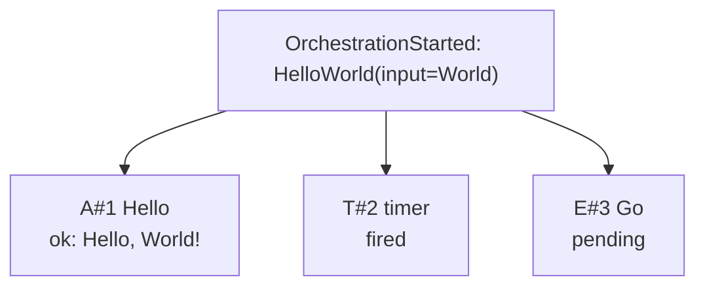

## Orchestration Visualization (Design Spec)

Goal: Let users generate a Markdown document with Mermaid diagrams that depict all currently known orchestrations, their pending/completed work, and status, sourced from the provider-backed history.

### Scope and MVP

- Read orchestration histories from a `HistoryStore` (FS and in-memory supported).
- Compute an easy-to-understand snapshot per instance.
- Emit a `docs/orchestrations.md` file with:
  - A summary table (instance, name, status).
  - A Mermaid diagram per instance capturing activities, timers, and external events (pending/completed).
- No live server; static generation on demand. Optional watch mode later.

### Data model (snapshots)

We derive snapshots from history (and/or `Runtime::get_orchestration_status`). Proposed structs:

```rust
pub enum ItemState { Pending, Completed, Failed }

pub struct ActivitySnap {
    pub id: u64,
    pub name: String,
    pub state: ItemState,
    pub result: Option<String>,
    pub error: Option<String>,
}

pub struct TimerSnap {
    pub id: u64,
    pub state: ItemState, // Pending or Completed
    pub fire_at_ms: Option<u64>,
}

pub struct ExternalSnap {
    pub id: u64,
    pub name: String,
    pub state: ItemState, // Pending or Completed
    pub data: Option<String>,
}

pub struct InstanceSnapshot {
    pub instance: String,
    pub name: String,
    pub input: Option<String>,
    pub status: OrchestrationStatus,
    pub activities: Vec<ActivitySnap>,
    pub timers: Vec<TimerSnap>,
    pub externals: Vec<ExternalSnap>,
}
```

Extraction rules (from `Event`):

- `OrchestrationStarted { name, version, input, parent_instance?, parent_id? }` → instance name + version + input
- Activity: `ActivityScheduled` → Pending; upgrade to Completed/Failed when matching `ActivityCompleted/Failed` with same `id` appears
- Timer: `TimerCreated` → Pending; upgrade to Completed when `TimerFired` with same `id` appears (carry last `fire_at_ms` seen)
- External: `ExternalSubscribed` → Pending; upgrade to Completed when matching `ExternalEvent` appears
- Status: `OrchestrationCompleted` → Completed with output; `OrchestrationFailed` → Failed with error; else Running

### Rendering model

We generate Mermaid flowcharts for readability and compactness.

- Nodes
  - `START`: OrchestrationStarted (name + input)
  - Activities: `A#{id}` with multiline label: `name` and `[pending|ok|err]` (and result/error where short)
  - Timers: `T#{id}` with label: `delay or fire_at_ms` and `[pending|fired]`
  - Externals: `E#{id}` with label: `name` and `[pending|delivered]`
- Edges
  - `START -->` every scheduled/subscribed node
  - Optional edges between scheduled and completed nodes are implicit in the label; we emphasize state in the node instead of adding extra edges

Example per-instance flowchart:



Summary section at top of Markdown (example):

| Instance | Name | Status |
|---|---|---|
| inst-123 | HelloWorld | Completed(Hello, World!) |
| inst-abc | WaitEvent | Running |

### API surface (library helpers)

- Snapshot builder (works with `Runtime` or directly with `HistoryStore`):

```rust
pub async fn snapshot_all(rt: &Runtime) -> Vec<InstanceSnapshot>;
pub async fn snapshot_all_from_store(store: Arc<dyn HistoryStore>) -> Vec<InstanceSnapshot>;
```

- Rendering helpers:

```rust
pub fn render_mermaid_flowchart(s: &InstanceSnapshot) -> String; // returns Mermaid DSL
pub fn render_markdown(snapshots: &[InstanceSnapshot]) -> String; // full markdown doc
```

### CLI (optional utility)

`dtf-viz` example binary:

- `--fs-root ./dtf-data` Read from FS provider root
- `--out docs/orchestrations.md` Output path
- `--watch` (future) Regenerate on changes (polling or fs notify)

### Performance and limits

- For very long histories, include only the latest state per correlated id and summary counts. Optionally elide large `result/error` payloads.
- Render truncation hints in node labels (e.g., `result=...` when over N chars).

### Future enhancements

- Support `stateDiagram-v2` rendering alternative
- Group by orchestration name; collapse instances under toggles
- Embed links to raw history dumps or instance admin actions
- Publish via mdBook or GitHub Pages

### Acceptance criteria (MVP)

- Running `dtf-viz --fs-root ./dtf-data --out docs/orchestrations.md` produces a Markdown file that:
  - lists all instances and their status
  - embeds one Mermaid diagram per instance reflecting activities, timers, and externals with correct pending/completed states
  - renders correctly in common Markdown viewers with Mermaid support


