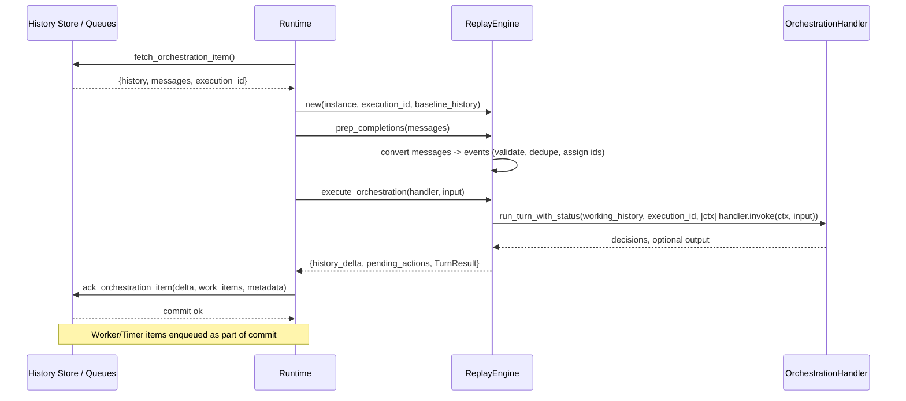
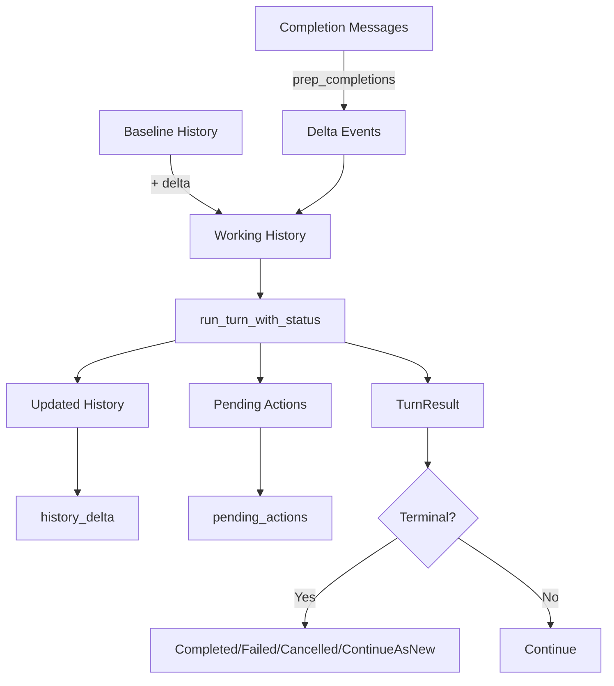

# ReplayEngine Architecture

## Purpose

ReplayEngine executes one deterministic orchestration evaluation (a “turn”) by:
- Replaying completions from history (and the current completion batch)
- Polling the orchestration function exactly once
- Recording any new decisions and appending new events

It is pure with respect to external side-effects: it only transforms history and decisions. The runtime owns persistence and queue dispatch.

## Responsibilities

- Input assembly: combine baseline history with this-turn completion events
- Deterministic replay: run orchestration code once with `OrchestrationContext`
- Decision capture: collect `Action`s recorded during the poll
- Event materialization: append new events produced during the poll
- Nondeterminism guard: detect obvious mismatches (completion kind, missing schedules)
- Cancellation/terminal detection: surface terminal outcomes early (Completed/Failed/Cancelled/ContinueAsNew)

Non-responsibilities (owned by Runtime):
- Persisting history and actions atomically
- Enqueuing worker/timer/orchestrator work items
- Acknowledging queue messages
- Version resolution and execution-id management

## Turn Lifecycle

1) Prep completions (convert work items to events)
- Validate each completion belongs to the current execution_id
- Drop duplicates already persisted or staged this turn
- Detect mismatches (e.g., completion kind doesn’t match scheduled kind)
- Stage converted events in `history_delta` with assigned `event_id`s

2) Execute orchestration (single poll)
- Build `working_history = baseline_history + history_delta`
- Invoke `run_turn_with_status(working_history, execution_id, |ctx| handler.invoke(ctx, input))`
- Capture: updated history view, recorded decisions, optional output, nondeterminism flag

3) Apply results
- If nondeterminism flagged: return Failed with message
- Extend `history_delta` with events produced during poll (beyond prep completions)
- Write pending `Action`s for the runtime to materialize after persistence
- If `OrchestrationCancelRequested` exists in final history: return Cancelled
- If a `ContinueAsNew` decision exists: return ContinueAsNew
- If orchestrator returned `Ok(result)`/`Err(error)`: return Completed/Failed
- Otherwise: return Continue (no terminal outcome yet)

## Determinism Model (Essence)

ReplayEngine enforces a single-poll, history-driven execution:
- All awaits are resolved from history; newly scheduled work is recorded as events and not awaited in the same turn
- The orchestration function is polled once per turn; it either returns a terminal result or yields Pending
- On the next turn, newly arriving completions are replayed, allowing the function to advance deterministically

Key invariants:
- No side effects during replay: orchestration code only schedules work and awaits durable futures
- Completions must match prior schedules by kind and id; mismatches are nondeterministic
- Execution isolation: only completions for the current `execution_id` are considered

## Data Flow

Inputs:
- instance: String
- execution_id: u64
- baseline_history: Vec<Event>
- completion messages (WorkItem)

Outputs (to Runtime):
- history_delta: Vec<Event>
- pending_actions: Vec<Action>
- TurnResult: Continue | Completed(String) | Failed(String) | ContinueAsNew{input,version} | Cancelled(String)

## Error Handling

- Nondeterminism detection returns Failed with a descriptive message
- Panic during user code is caught and returned as Failed("nondeterministic: ...")

## Why Single-Poll?

Single-poll preserves determinism and enables clean atomicity boundaries:
- Decisions and new events are computed from a consistent history snapshot
- Persistence and queue dispatch can be committed atomically by the runtime
- Next progress always depends on exogenous completions, not local time or retries

## Extensibility

Potential future enhancements:
- Stable correlation buffers for multi-completion races (reduce strict head-of-queue ordering)
- Rich nondeterminism diagnostics (e.g., await-mismatch proofs)
- Batched select/join optimizations

## File Reference

- Implementation: `src/runtime/replay_engine.rs`
- Entry points:
  - `ReplayEngine::new(instance, execution_id, baseline_history)`
  - `ReplayEngine::prep_completions(messages)`
  - `ReplayEngine::execute_orchestration(handler, input)`

